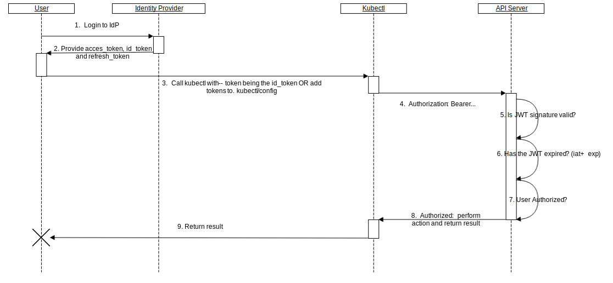

# Authentication

Kubernetes has two types of users: service account, and normal users.

* **Normal Users**: managed by third party. Kubernetes *doesn not* have user object.
* **[Service Accounts](../../object/serviceaccount/README.md)**: managed by Kubernetes.

API requests are

* normal user requests
* service account requests
* anonymous requests


# Authentication Strategies

* client certificates
* bearer tokens
* authenticating proxy
* HTTP basic auth


## X509 Client Certs

If a client certificate is presented and verified, the common name of the subject is used as the user name for the request. To enable it:
`kube-apiserver --client-ca-file=<path-to-certs>`.


## Static Token File

To enable it: `kube-apiserver --token-auth-file=<path-to-token>`. User pass Bearer token in HTTP request `Authorization: Bearer <token>` header.


## Bootstrap Tokens

The dynamically-managed Bearer token is stored as `Secrets` in the `kube-system` namespace. To enable it: `kube-apiserver --experimental-bootstrap-token-auth`.
`--controllers=tokencleaner`? TODO


## Static Password File

To enable it: `kube-apiserver --basic-auth-file=<path-to-file>`. User pass Bearer token in HTTP request `Authorization: Basic BASE64ENCODED(USER:PASSWORD)` header.


## Service Account Tokens

To enable it: `kube-apiserver --service-account-key-file=<path-to-file> --service-account-lookup=true`.

One can specify `ServiceAccount` in `serviceAccountName` field of a `PodSpec`.

```
apiVersion: apps/v1
kind: Deployment
metadata:
  name: nginx-deployment
  namespace: default
spec:
  replicas: 3
  template:
    metadata:
    # ...
    spec:
      serviceAccountName: bob-the-bot
      containers:
      - name: nginx
        image: nginx:1.7.9
```

> If `serviceAccountName` is unspecified, and one uses `ServiceAccount` "bob-the-bot" to create the "nginx-deployment", Kubernetes will use `default` `ServiceAccount` in that `namespace` to create `Pod`.

> WARNING: Because service account tokens are stored in secrets, any user with read access to those secrets can authenticate as the service account. Be cautious when granting permissions to service accounts and read capabilities for secrets.


## OpenID Connect Tokens

The API server will make sure the JWT signature (`id_token`) is valid by checking against the certificate named in the configuration.



This is where one can configure third-party iendity provider.

E.g. With `Dex`
```
./kube-apiserver \
  --oidc-issuer-url=https://dex.example.com \
  --oidc-client-id=example-app \
  --oidc-username-claim=email \
  # ...

kubectl config set-credentials --token=$ID_TOKEN
```

## Webhook Token Authentication


## Authenticating Proxy

In order to prevent header spoofing, the authenticating proxy is required to present a valid client certificate to the API server for validation against the specified CA before the request headers are checked.


# Anonymous requests


# User impersonation

`kubectl --as=system:serviceaccount:<namespace>:<serviceaccount_name> -n <namespace> --as-group=system:<group>`

To allow an user to impersonate others, grant it a ClusterRole:

```
apiVersion: rbac.authorization.k8s.io/v1
kind: ClusterRole
metadata:
  name: impersonator
rules:
- apiGroups: [""]
  resources: ["users", "groups", "serviceaccounts"]
  verbs: ["impersonate"]
```

# Reference

* https://kubernetes.io/docs/reference/access-authn-authz/authentication
* https://speakerdeck.com/ericchiang/kubernetes-access-control-with-dex?slide=36
* https://kubernetes.io/docs/reference/access-authn-authz/controlling-access/
