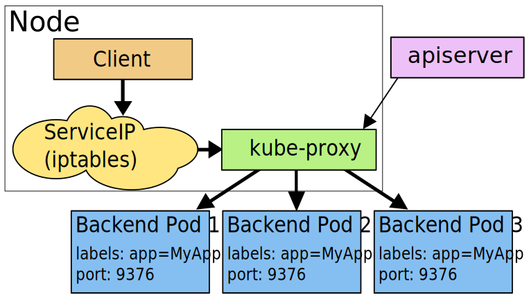

# kube-proxy

`kube-proxy` is used to enable non-native (aka, external) applications to communicate with `Service`/`Pod`.

The Kubernetes network proxy runs on each node. This reflects `services` as defined in the Kubernetes API on each node and can do simple TCP, UDP, and SCTP stream forwarding or round robin TCP, UDP, and SCTP forwarding across a set of backends [1].

`kube-proxy` enables the Kubernetes `service` abstraction by maintaining network rules on the host and performing connection forwarding [2].

`kube-proxy` is responsible for implementing a form of virtual IP for `Services` of type other than `ExternalName` [3].

`kube-proxy` has three modes:
* iptables proxy: the default operating mode since Kubernetes v1.2.
* ipvs proxy
* userspace proxy


# Proxy Mode [3]

## userspace

* `kube-proxy` watches the Kubernetes master for the addition and removal of `Service` and `Endpoints` objects.
* For each `Service` it opens a port (randomly chosen) on the local node.
* Any connections to this “proxy port” will be proxied to one of the `Service`’s backend `Pods` (as reported in `Endpoints`). `SessionAffinity` affects `Pod` choice.
* It installs iptables rules which capture traffic to the `Service`’s clusterIP (which is virtual) and Port and redirects that traffic to the proxy port which proxies the backend `Pod`. By default, the choice of backend is round robin.



> ServiceIP = clusterIP in the graph above.


## iptables

* `kube-proxy` watches the Kubernetes master for the addition and removal of `Service` and `Endpoints` objects.
* For each `Service`, it installs iptables rules which capture traffic to the `Service`’s `clusterIP` (which is virtual) and `Port` and redirects that traffic to one of the `Service`’s backend sets.
* For each `Endpoints` object, it installs iptables rules which select a backend `Pod`. By default, the choice of backend is random.
* Pro: iptables need not switch back between userspace and kernelspace, it should be faster and more reliable than the userspace proxy.
* Con: iptables proxier cannot automatically retry another `Pod` if the one it initially selects does not respond, so it depends on having working `readiness probes`.


> ServiceIP = clusterIP in the graph above.


## ipvs

* `kube-proxy` watches Kubernetes `Services` and `Endpoints`, calls `netlink` interface to create ipvs rules accordingly and syncs ipvs rules.
* When `Service` is accessed, traffic will be redirected to one of the backend `Pods`.
* Pro:
  - uses hash table as the underlying data structure and works in the kernel space -> redirect traffic faster; sync rules faster.
  - more options for load balancing algorithm.
    - `rr`: round-robin
    - `lc`: least connection
    - `dh`: destination hashing
    - `sh`: source hashing
    - `sed`: shortest expected delay
    - `nq`: never queue


# Configuration

`kube-proxy` network defaults are set in a config file: `/usr/local/bin/kube-proxy --config=/var/lib/kube-proxy/config.conf`

If `kube-proxy` is run through `DaemonSet`, one can customize its configuration path in `DaemonSet` spec:

```
spec:
  containers:
  - command:
    - /usr/local/bin/kube-proxy
    - --config=/var/lib/kube-proxy/config.conf
    image: gcr.io/google_containers/kube-proxy-amd64:v1.9.6
```

Or one can customize its `ConfigMap`: `kubectl edit cm kube-proxy -n kube-system`. (This `ConfigMap` is mounted to `DaemonSet` as `/var/lib/kube-proxy/config.conf`.)


# Concepts

* userspace: a set of locations where normal user processes run (i.e everything other than the kernel).
* kernelspace: the location where the code of the kernel is stored, and executes under.


# Reference

1. https://kubernetes.io/docs/reference/command-line-tools-reference/kube-proxy/
2. https://kubernetes.io/docs/concepts/overview/components/#kube-proxy
3. https://kubernetes.io/docs/concepts/services-networking/service/#virtual-ips-and-service-proxies
