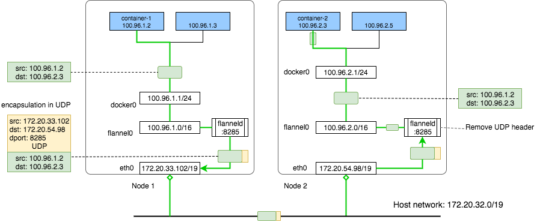

# Flannel

Flannel is a simple and easy way to configure a layer 3 IPv4 network fabric designed for Kubernetes. It only takes care of host to host traffic, not container traffic. But Flannel provides CNI plugin for Kubernets and Docker.

*Layer 1 IPv4 network is public IP. Layer 2 IPv4 network is VPC network.*

* `flanneld` allocate subnet for each node.
* Stores configuration in Kubernetes API or `etcd`.
* Flannel uses linux bridge `cbr0`.

## Installation

`kubectl apply -f https://raw.githubusercontent.com/coreos/flannel/master/Documentation/kube-flannel.yml`

* `flanneld` is run from k8s DaemonSet `kube-flannel-ds-amd64` namespace `kube-system` on each node.
* `cni-config.json` and `net-config.json` lives in k8s ConfigMap `kube-flannel-cfg` namespace `kube-system`.

## How does it work

```
$ cat /run/flannel/subnet.env
FLANNEL_NETWORK=10.244.0.0/16
FLANNEL_SUBNET=10.244.5.1/24
FLANNEL_MTU=8951
FLANNEL_IPMASQ=true
```

* Creates a flat network which runs above the host network.
* All containers(Pod) will be assigned one ip address in this overlay network (FLANNEL_NETWORK).

[ Quote from https://blog.laputa.io/kubernetes-flannel-networking-6a1cb1f8ec7c ]



AWS VPC network: all instances are in one VPC subnet 172.20.32.0/19. They have been assigned ip addresses in this range, all hosts can connect to each other because they are in same LAN.

Flannel overlay network: flannel has created another network 100.96.0.0/16, it’s a bigger network which can hold 2¹⁶(65536) addresses, and it’s across all kubernetes nodes, each pod will be assigned one address in this range, later we will see how flannel achieves this.

In-Host docker network: inside each host, flannel assigned a 100.96.x.0/24 network to all pods in this host, it can hold 2⁸(256) addresses. The docker bridge interface docker0 will use this network to create new containers.

## Reference

* https://github.com/coreos/flannel
* https://blog.laputa.io/kubernetes-flannel-networking-6a1cb1f8ec7c
* https://coreos.com/flannel/docs/latest/flannel-config.html
* https://github.com/coreos/flannel/blob/master/Documentation/backends.md
